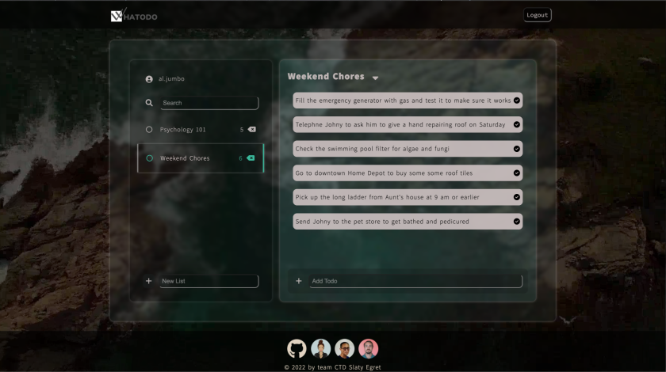
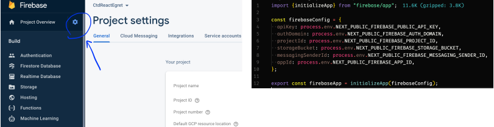
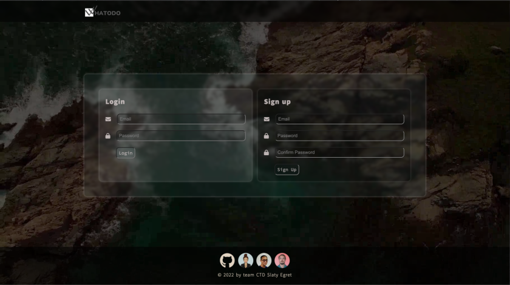
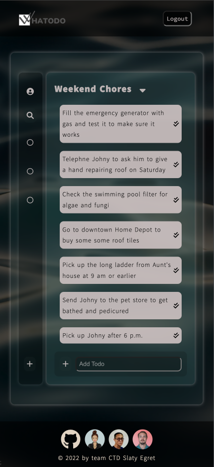
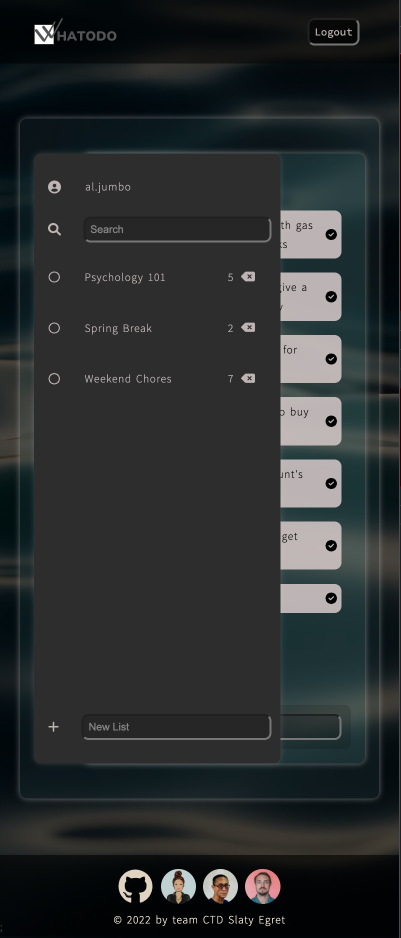

<h2 align="center">Whatodo App</h2>



<h5 align="center">A Todo App Built on Next.js with Firebase Auth and Cloud Firestore</h5>
<p align="center">Project by Code the Dream Spring 2022 Practicum - Slaty Egret Team</p>

   

<p></p>

Code the Dream offers free intensive training in software development to people from diverse low-income backgrounds. Its Practicum curriculum offers opportunities for the Code the Dream School trainees to work collaboratively in dev teams on real-life, deployable software engineering projects.

## About

This project is the work by team Slaty Egret of the Code the Dream Spring 2022 Practicum to develop a todo app bootstrapped with [Create Next App](https://create-next-app.js.org/) using [Firebase](https://firebase.google.com/) Authentocation and Cloud Firestore. The app is deployed on Firebase for personal use by the team members and as the final exercise of the project.

## Installation

Clone or fork from this repo if you would like to tweak and add features to the app. You may push a branch back here to give us feedback on how the app has been taken further. You can also clone the app to use it personally in your browser. The app has minimal dependencies and can easily be set up with a Google account, which come with access to Firebase, as follows. In your terminal, run:

```
$ git clone https://github.com/Sanlung/ctd-practicum-slaty-egret.git
```

or

```
$ git clone git@github.com:Sanlung/ctd-practicum-slaty-egret.git
```

Once you have cloned the repo, in your local project directory run:

```
$ npm install
```

Next, go to the [Firebase](https://console.firebase.google.com/) website and sign in with your Google account. Follow their official [documentation](https://firebase.google.com/docs/web/setup?hl=en&authuser=0) to set up a project⎯which can be done with the Spark plan that is free⎯and add your app to the project. In the project console, go to Project Settings, copy the configuration keys for using the Firebase SDK, and create a `.env.local` file for those keys in the root directory of your project. The configuration variables will then be imported in the `/config/firebaseConfig.js` file that you cloned along with the project.



Return to the Firebase console and follow the on-screen instructions to add Cloud Firestore and Authentication to your project⎯choose email and password as the sign-in method. You can find help in the official documentation should you feel uncertain.

Now you are all set and ready to use the Whatodo App.

### Usage

In your project directory run:

```
$ npm run dev
```

And you have the app in port `localhost:3000`.

<p></p>

Sign up with an email and set your password, and enjoy your own todo app.

<p>  </p>

You can sort a list chronologically, and may search items in the lists or list names for a certain keyword.

<p></p>

Please let us know of any bugs or imperfections. Your input will be greatly appreciated. It has been a wonderful learning experience for us.

## Contributors

[](https://github.com/Asel-K) [](https://github.com/Sanlung) [](https://github.com/dumpidum)
